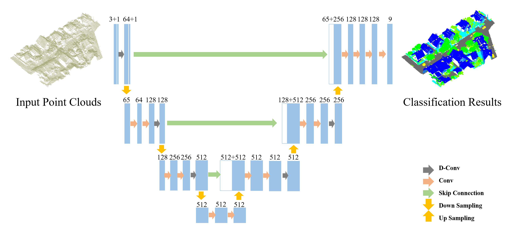
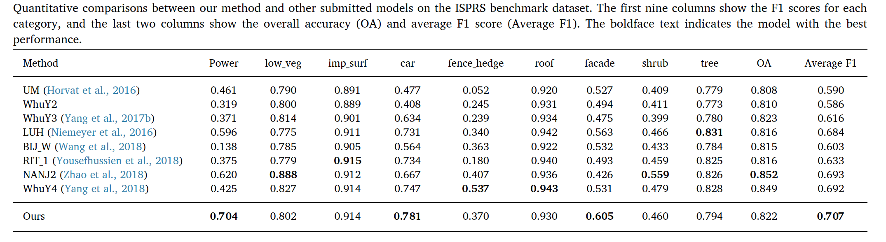

This is the source code for our paper <b></b>.


# Directionally Constrained Fully Convolutional Neural Network For Airborne Lidar Point Cloud Classification


Introduction
------------
This is the source code for our paper **Directionally Constrained Fully Convolutional Neural Network For Airborne Lidar Point Cloud Classification**

Paper link: https://www.sciencedirect.com/science/article/pii/S0924271620300381

Network Architecture
--------------------
The architecture of our proposed model is as follows



## Installation
In our experiment, All the codes are tested in Python3.5 (If you use Python 2.7, please add some system paths), CUDA 8.0 and CUDNN 5.1.

Install TensorFlow (We use v1.4.1).
Install other python libraries like h5py
Compile TF operator (Similar to PointNet++). Firstly, you should find Tensorflow include path and library paths.
    import tensorflow as tf
    # include path
    print(tf.sysconfig.get_include())
    # library path 
    print(tf.sysconfig.get_lib())
Then, change the path in all the complie file, like tf_utils/tf_ops/sampling/tf_sampling_compile.sh Finally, compile the source file, we use tf_sampling as example.

    cd tf_utils/tf_ops/sampling
    chmod +x tf_sampling_compile.sh
    ./tf_sampling_compile.sh

* Clone this repo
```
git clone https://github.com/lixiang-ucas/D-FCN.git

```
## Dataset
* Download the ISPRS Vaihinge dataset from (http://www2.isprs.org/commissions/comm3/wg4/3d-semantic-labeling.html)
* Download the IEEE GRSS Data Fusion Contest 2018 dataset from (http://www.grss-ieee.org/community/technical-committees/data-fusion/2018-ieee-grss-data-fusion-contest/)

## Data Preprocessing
During training, we randomly select a 30mx30mx40m cuboid region from the whole scene and then randomly choose 8,192 points from the cuboid as the model input. To further reduce the risk of overfitting and make the model more robust, the selected 8,192 points are randomly dropped during the training stage. By default, the dropout ratio is set to 12.5% in the following sections. 

With respect to the testing dataset, the scenes were segmented into blocks of 30mx30m grids in the horizontal direction. Note that small blocks generated at the edge of the scene are merged into the surrounding large blocks to ensure the integrity of each block. Also note that the test blocks can have substantially different numbers of points. Fortunately, due to the fully convolution nature of the proposed D-FCN model, all the points in each test block can be input directly into the model for point classification.

Or one can find the pre-prcessed data at ./Data folder.

## Training & Testing

python train_eval.py

## Eval
Test performance on ISPRS Vaihingen dataset:


Test performance on DFC dataset:


## Acknowledgements
This code is heavily borrowed from [PointSIFT](https://github.com/MVIG-SJTU/pointSIFT)


## Citation

If you find this useful in your research, please consider citing:

  @article{wen2020directionally,   
  title={Directionally constrained fully convolutional neural network for airborne LiDAR point cloud classification},    
  author={Wen, Congcong and Yang, Lina and Li, Xiang and Peng, Ling and Chi, Tianhe},   
  journal={ISPRS Journal of Photogrammetry and Remote Sensing},   
  volume={162},   
  pages={50--62},   
  year={2020},   
  publisher={Elsevier}   
}
